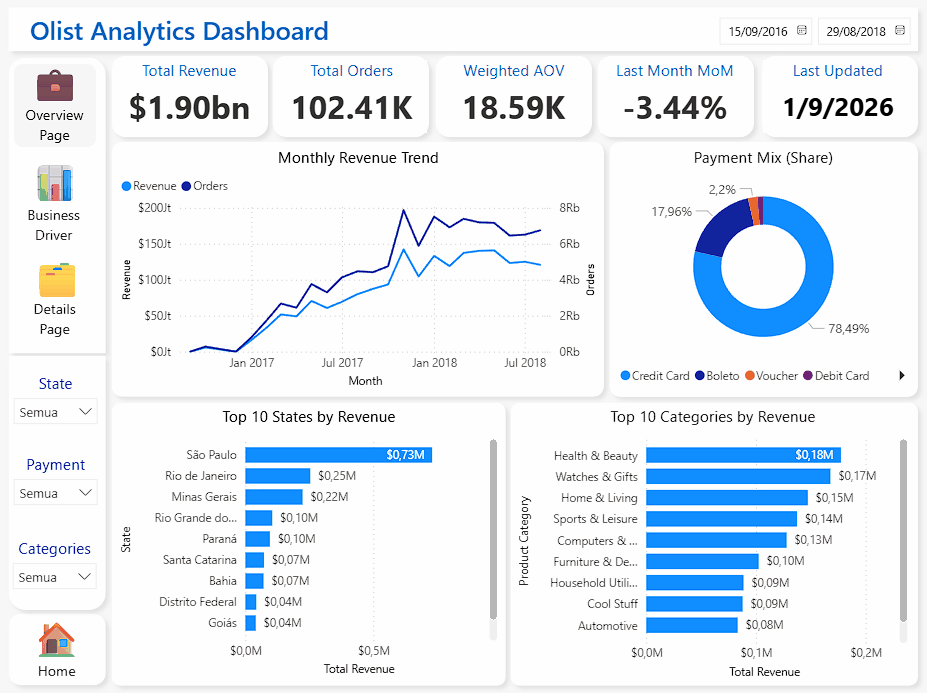
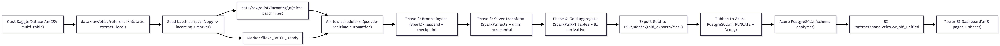
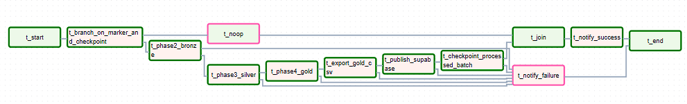

# 📊 Olist Analytics  
### Pseudo Realtime Dashboard using Airflow and Azure

An end-to-end analytics project that simulates **near real-time data processing** using batch-based ingestion, automated orchestration, and a unified BI contract for dashboard consumption.

This project demonstrates how production-style data pipelines can be built using **Airflow, Spark, Azure PostgreSQL, and Power BI** — without relying on real-time streaming infrastructure.

An optional analytics-driven prediction module is included to demonstrate how forecasting can be layered on top of a stable analytics platform.

---

## 🚀 Overview

**Olist Analytics** is designed to mimic how real-world analytics platforms operate.  
Data arrives in small batches, is automatically processed through multiple layers, published to a cloud database, and instantly reflected in a business dashboard.

The focus of this project is **architecture, orchestration, and BI reliability**, not machine learning or experimentation.

---

## 🎥 End-to-End Demo



---

## 🏗️ System Architecture

The system follows a layered analytics architecture:

- Raw → Bronze → Silver → Gold
- Export → Publish to Azure PostgreSQL
- SQL Views as BI contract
- Power BI as the final consumer



---

## 🔄 Airflow Workflow

All processing steps are orchestrated using **Apache Airflow**.

Key characteristics:
- Fully automated scheduling
- Batch-driven execution
- Safe no-op behavior when no new data arrives
- Explicit success and failure handling



---

## 🧰 Tech Stack

| Layer | Technology |
|------|-----------|
| Orchestration | Apache Airflow |
| Processing | Apache Spark (PySpark) |
| Storage (Analytics) | Azure PostgreSQL |
| Analytics Prediction | Databricks |
| BI & Visualization | Power BI |
| Scripting | Bash / Python |
| Environment | Docker, WSL |
| Version Control | Git |

---

## 📦 Data & Pseudo-Realtime Concept

This project uses a **pseudo-realtime** approach:

- Data arrives in **micro-batches**
- Each batch is marked using a `_BATCH_<id>.ready` file
- Airflow automatically detects and processes new batches
- Previously processed batches are skipped using checkpoints

This design allows:
- Safe automation
- Repeatable demos
- Realistic incremental behavior

---

## 🧾 BI Contract (Single Source of Truth)

All dashboards consume data from **one unified SQL view**: analytics.vw_pbi_unified


Why this matters:
- Consistent slicers across visuals
- No broken filters
- Clear separation between data engineering and BI modeling

This view acts as the **API layer** between the data platform and Power BI.

---
## 🔮 Analytics Extension — Revenue Prediction (Optional)

As an extension to the analytics platform, a lightweight prediction module forecasts **next-day revenue** using Gold-layer KPI data.

Key points:
- Uses analytics-ready data (no raw ingestion)
- Trained in Databricks with Spark ML
- Outputs predictions back to PostgreSQL
- Consumed directly by Power BI for monitoring

This module demonstrates how predictive insights can be integrated **without changing the core data pipeline**.

---

## 📊 Dashboard Output

The Power BI dashboard contains three main pages:

1. **Executive Overview**  
   High-level KPIs and performance trends

2. **Composition & Business Insight**  
   Breakdown by state, payment type, and category

3. **Detail & Evidence**  
   Granular tables for validation and analysis

4. **Forecast Monitoring**
   Actual vs Forecast revenue and error trends

Dashboards automatically reflect new data after each successful pipeline run.

---

## ▶️ How to Run (Quickstart)

High-level steps to run the project:

1. Prepare environment variables
2. Seed a new data batch into `incoming/`
3. Start Airflow scheduler
4. Let the DAG process the batch automatically
5. Refresh Power BI dashboard

📌 Detailed steps are available in the documentation.

---

## 🗂️ Project Structure (High-Level)

```
├── airflow/        # Airflow DAGs and orchestration logic
├── spark_jobs/     # Spark jobs for Bronze, Silver, and Gold layers
├── data/           # Raw data, checkpoints, and exported outputs
├── sql/            # Database schema and SQL views (BI contract)
├── docs/           # Project documentation
├── docker/         # Docker setup for Airflow
└── README.md       # Project overview
```
---

## 📚 Documentation Index

Detailed documentation is available in the `docs/` folder:

- `00_one_pager.md` — Business context, objectives, and value
- `01_data_dictionary.md` — Dataset definitions and key fields
- `02_architecture.md` — End-to-end system architecture
- `03_bronze.md` — Raw ingestion and Bronze layer processing
- `04_silver.md` — Data cleaning and Silver layer transformations
- `05_gold.md` — Business-ready Gold layer models
- `06_dashboard_spec.md` — Power BI dashboard design and KPIs
- `06_demo_steps.md` — Demo and walkthrough steps
- `07_sql_views.md` — BI contracts and SQL views
- `08_orchestration.md` — Airflow DAGs and orchestration logic
- `09_runbook.md` — How to run, operate, and troubleshoot
- `10_prediction_databricks.md` — Analytics-driven revenue prediction 

---

## 🧠 Notes

- Machine Learning is **intentionally excluded**
- The focus is on **data engineering, orchestration, and BI**
- The architecture is designed to be **easy to explain, demo, and extend**

---

## ✅ Final Thoughts

This project demonstrates how to build a **reliable analytics platform** using simple, well-structured components — the same principles used in real production systems.

It is intentionally designed to be:
- readable
- explainable
- interviewer-friendly
