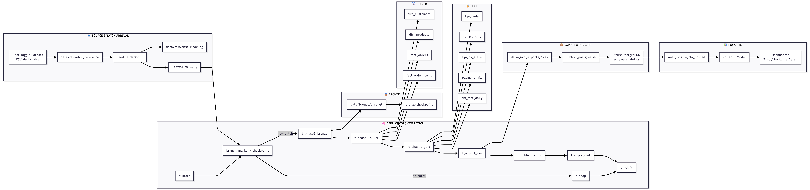

# 🏗️ System Architecture

This document describes the **end-to-end system architecture** of the project  
**_Olist Analytics: Pseudo Realtime Dashboard using Airflow and Azure_**.

The architecture is designed to simulate **near real-time analytics** using batch-based ingestion, production-like orchestration, and a clear BI contract for dashboard consumption.

---

## 🎯 Architecture Goals

The system is built with the following goals in mind:

- Simulate **pseudo-realtime data processing** using batch arrivals
- Ensure **automated orchestration** with clear dependency control
- Separate concerns across **Bronze → Silver → Gold** layers
- Provide a **single, stable BI contract** for Power BI
- Use **Azure PostgreSQL** as the final serving layer

---

## 🧩 High-Level Flow Overview

At a high level, the system follows this flow:

1. **Raw data** arrives in micro-batches (pseudo-realtime)
2. **Airflow** detects and orchestrates each batch automatically
3. Data is processed through **Bronze, Silver, and Gold** layers using Spark
4. Aggregated results are **exported and published** to Azure PostgreSQL
5. **SQL views** expose a stable BI contract
6. **Power BI** consumes a single unified view for dashboards

---

## 🔄 End-to-End Architecture Diagram

Below is the main system architecture diagram that ties all components together.

> 📌 **Note**  
> This diagram intentionally shows more detail than a typical overview to demonstrate:
> - orchestration complexity  
> - incremental data flow  
> - clear ownership per layer  

---

### 📷 System Architecture Diagram (Detailed)

---

## 📥 Source & Pseudo-Realtime Batch Arrival

- The source dataset is the **Olist Kaggle Dataset** (CSV, multi-table).
- A local **seed batch script** simulates data arrival by:
  - selecting a subset of files
  - copying them into an `incoming/` directory
  - generating a `_BATCH_<id>.ready` marker file
- Each batch represents a **micro-batch event**, not true streaming.

This approach allows the pipeline to behave like near real-time ingestion while remaining fully reproducible.

---

## 🧠 Orchestration Layer (Airflow)

**Apache Airflow** is responsible for end-to-end automation.

Key characteristics:
- Fully automated scheduling
- Marker-based batch detection
- Checkpoint-aware branching
- No-op safe execution (no batch ≠ no failure)

Main orchestration flow:
- Detect new batch marker + checkpoint state
- Execute processing phases sequentially
- Publish results only after successful validation
- Notify success or failure explicitly

Airflow itself contains **no transformation logic** — it only orchestrates executable tasks.

---

## 🥉 Bronze Layer — Raw but Structured

Purpose:
- Ingest raw CSV files
- Standardize schema and types
- Append data incrementally per batch

Characteristics:
- Append / partition-based storage
- Batch-level metadata logging
- Checkpoint tracking to avoid duplicate ingestion

This layer acts as the **single source of truth for raw ingested data**.

---

## 🥈 Silver Layer — Analytic-Ready Data

Purpose:
- Transform Bronze data into clean, joined datasets
- Prepare fact and dimension tables

Key outputs:
- `fact_orders`
- `fact_order_items`
- `dim_customers`
- `dim_products`

Characteristics:
- Incremental processing per batch
- Clear grain definitions
- Metadata logging for auditability

The Silver layer is optimized for **analytics and aggregation**, not BI consumption.

---

## 🥇 Gold Layer — KPI & BI Derivatives

Purpose:
- Compute business KPIs
- Prepare BI-friendly datasets

Outputs include:
- `kpi_daily`
- `kpi_monthly`
- `kpi_by_state`
- `payment_mix`
- `top_products`
- `pbi_fact_daily` (BI-only derivative)

Important design decision:
- **`pbi_fact_daily` exists purely for BI consumption**
- It is not treated as a core KPI table

---

## 📦 Export & Publish Layer

- Gold outputs are exported as CSV files
- A publish script loads data into **Azure PostgreSQL**
- The publish strategy uses:
  - `TRUNCATE` + `COPY`
  - simple, predictable, portfolio-safe behavior

Azure PostgreSQL acts as the **final serving layer**, not a transformation engine.

---

## 🧾 BI Contract (Single Source of Truth)

The BI contract is defined as: analytics.vw_pbi_unified

Why this matters:
- Power BI connects to **one view only**
- All slicers (date, state, payment, category) remain consistent
- No broken filters across visuals
- The database becomes a stable API for BI

Other views and tables exist to support this contract, not replace it.

---

## 📊 Power BI Consumption

Power BI responsibilities:
- Semantic modeling (mostly dimensions)
- DAX measures:
  - MoM growth
  - Payment share
  - Contribution %
  - AOV
- Dashboard pages:
  1. Executive Overview
  2. Composition & Business Insight
  3. Detail & Evidence

The dashboard automatically reflects new data after each successful pipeline run.

---

## 🚫 Out of Scope

To keep the architecture focused and realistic:

- ❌ Real-time streaming (Kafka, Spark Streaming)
- ❌ Machine Learning or forecasting
- ❌ Complex CDC or event-driven ingestion

These can be added later as future enhancements.

---

## ✅ Summary

This architecture demonstrates:
- A realistic pseudo-realtime design
- Clear separation of concerns
- Production-like orchestration
- Strong BI contract discipline
- Cloud-ready serving via Azure PostgreSQL

It is intentionally designed to be:
- easy to reason about
- easy to demo
- easy to explain in interviews
